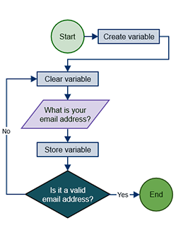

# Algorithms

_(...) is an unambiguous specification of **how to solve** a class of problems._

[Source](https://en.wikipedia.org/wiki/Algorithm)

[Source](http://study.com/academy/lesson/what-is-an-algorithm-in-programming-definition-examples-analysis.html)
