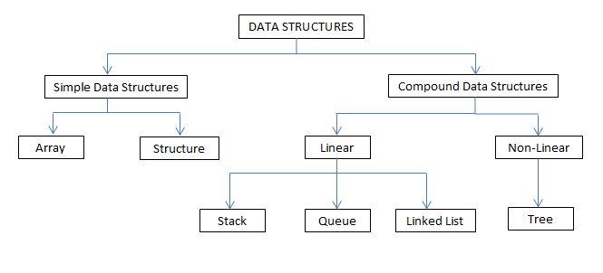

# Data Structures

_(...) is a particular way of organizing **data** in a computer so that it can be used efficiently._

[Source](https://en.wikipedia.org/wiki/Data_structure)

[Source](http://scanftree.com/Data_Structure/)