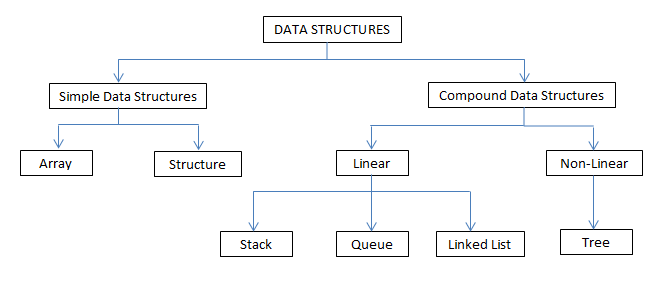
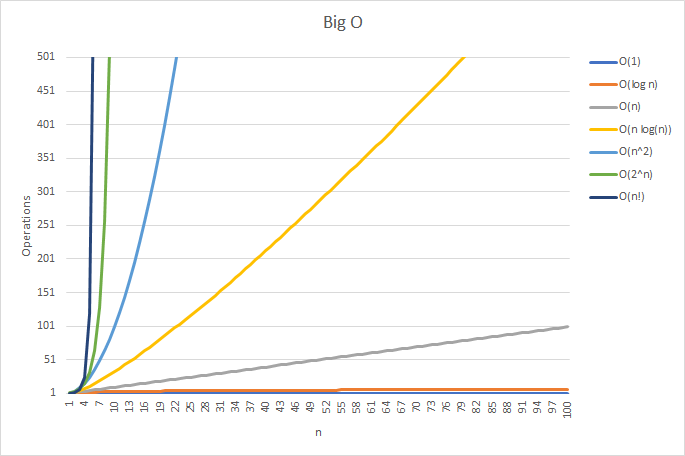
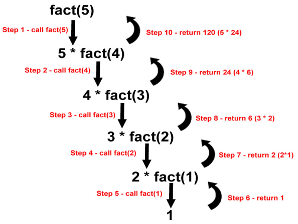
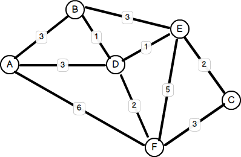
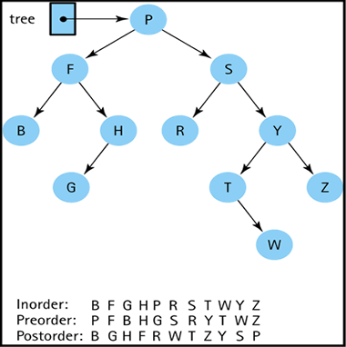
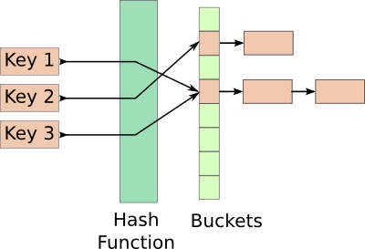
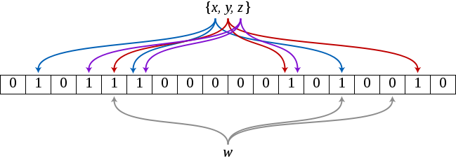
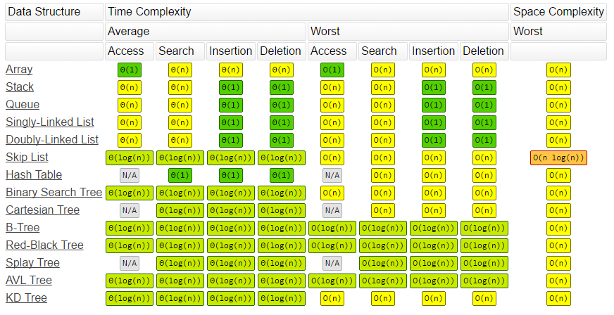
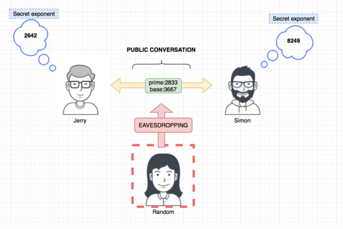
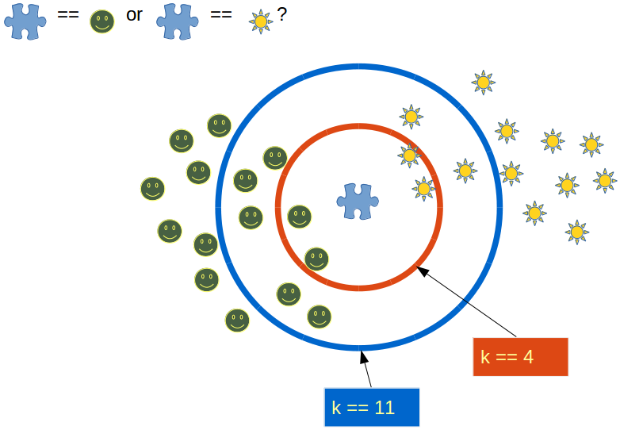

# Data Structures and Algorithms

## Introduction
### Algorithms

_(...) is an unambiguous specification of __how to solve__ a class of problems._

<div class="source">[Source](https://en.wikipedia.org/wiki/Algorithm)</div>

### Algorithms


<div class="source">[Source](http://study.com/academy/lesson/what-is-an-algorithm-in-programming-definition-examples-analysis.html)</div>

### Data Structures

_(...) is a particular way of organizing __data__ in a computer so that it can be used efficiently._

<div class="source">[Source](https://en.wikipedia.org/wiki/Data_structure)</div>

### Data Structures



<div class="source">[Source](http://scanftree.com/Data_Structure/)</div>

## Search Algorithms
### Search algorithm

_... is any algorithm which solves the Search problem, namely, to __retrieve information stored within some __data structure__ ..._

<div class="source">[Source](https://en.wikipedia.org/wiki/Search_algorithm)</div>

### Linear search

_(...) or __sequential search__ is a method for finding a target value within a list._

_It sequentially checks each element of the list for the target value until a match is found or until all the elements have been searched._

<div class="source">[Source](https://en.wikipedia.org/wiki/Linear_search)</div>

### Binary search

_(...) is a search algorithm that finds the position of a target value within a __sorted array__._
    
(...) compares the target value to the middle element of the array; if they are unequal, the half in which the target cannot lie is eliminated and the search continues on the remaining half until it is successful. If the search ends with the remaining half being empty, the target is not in the array.

<div class="source">[Source](https://en.wikipedia.org/wiki/Binary_search_algorithm)</div>

### Linear vs Binary Search


<div class="source">[Source](https://blog.penjee.com/binary-vs-linear-search-animated-gifs/)</div>

### Comparisons

Nb. of items (n) | Linear search | Binary search
 - | :-: | :-:
8 | n | 3 
100| n | 7 
4000000000 | n | 32 
**Time** | *linear* | *logarithmic* 
 | O(n) |  O(log n) 

### [Logarithms](https://www.khanacademy.org/math/algebra2/exponential-and-logarithmic-functions/properties-of-logarithms/v/introduction-to-logarithm-properties)

$$\log_{10} 100 = 2$$ 
$$10^2 = 100$$ 

$$\log_2 32 = 5$$ 
$$2^5 = 32$$

$$\log 8 = 3$$
$$2^3 = 8$$ 

### Linear vs logarithmic

<center>

</center>

### Search Examples

```
"""
Search Examples
"""

import os, pathlib, sys
sys.path.append(str(pathlib.Path(os.path.dirname(__file__)).parent))
from _Tools import Tools

from A_Algorithms.search_linear import LinearSearch
from A_Algorithms.search_binary import BinarySearch
from A_Algorithms.search_binary_recursive import BinarySearchRecursive

search_class = LinearSearch

@Tools.execTime
def search_element(item, list_):
    Tools.pprint(list_)
    search_instance = search_class(item, list_)
    print("N: {}".format(len(list_)))
    print("Max. Steps: {}".format(search_class.MaxSteps(len(list_))))
    print("Position of {}: {}".format(item, search_instance.search()))
    print("Comparisions: {}".format(search_instance.comparisons))

def example1():
    item = 2
    list_ = [1, 2, 3, 4, 5, 6, 7]
    search_element(item, list_)

def example2(n):
    list_ = list(range(1, n + 1))
    item = list_[search_class.WorstCase(n)]
    search_element(item, list_)

def main():

    example1()

    print()
    for i in [10, 100, 10000, 1000000]:
        example2(i)
        print()

if __name__ == "__main__":
    main()
    print("Done!!")

```
### Algorithms
#### Search ADT

```
"""
Search ADT
"""

class Search():
    """Abstract class"""

    def __init__(self, item, list):
        """
        Class initializer
        :param item: element to find
        :param list: list of elements (can be unsorted)
        """
        self.item = item
        self.list = list
        self.comparisons = 0

    def search(self):
        """
        Search element in list
        :returns: element position if found, -1 otherwise
        """
        raise NotImplementedError("Must implement this")

    @staticmethod
    def WorstCase(size):
        """
        Gets the worst case element for the search method applied
        :returns: worst case element position
        """
        raise NotImplementedError("Must implement this")

    @staticmethod
    def MaxSteps(size):
        """
        Returns the number of steps for the worst case
        :returns: worst case number of steps
        """
        raise NotImplementedError("Must implement this")

```
#### BinarySearch

```
"""
BinarySearch
"""

from math import ceil, log
from A_Algorithms.search_adt import Search

class BinarySearch(Search):
    """Binary search"""

    def search(self):
        self.comparisons = 0
        start = 0
        end = len(self.list) - 1
        while start <= end:
            self.comparisons += 1
            mid = ceil((start + end) / 2)
            if self.list[mid] == self.item:
                return mid
            if self.list[mid] > self.item:
                end = mid - 1
            else:
                start = mid + 1
        return -1

    @staticmethod
    def WorstCase(size):
        return 0

    @staticmethod
    def MaxSteps(size):
        return ceil(log(size, 2))

```
#### BinarySearch - recursive

```
"""
BinarySearch - recursive
"""

from math import ceil
from A_Algorithms.search_binary import BinarySearch

class BinarySearchRecursive(BinarySearch):
    """Recursive Binary search"""

    def solve(self, start, end):
        """Recursive function that compare mid point"""
        if start > end:
            return -1
        mid = ceil((start + end) / 2)
        self.comparisons += 1
        if self.list[mid] == self.item:
            return mid
        if self.item < self.list[mid]:
            return self.solve(start, mid-1)
        return self.solve(mid+1, end)

    def search(self):
        self.comparisons = 0
        return self.solve(0, len(self.list) - 1)

```
#### LinearSearch

```
"""
LinearSearch
"""

from A_Algorithms.search_adt import Search

class LinearSearch(Search):
    """Linear search"""

    def search(self):
        self.comparisons = 0
        for pos, value in enumerate(self.list):
            self.comparisons += 1
            if value == self.item:
                return pos
        return -1

    @staticmethod
    def WorstCase(size):
        return size - 1

    @staticmethod
    def MaxSteps(size):
        return size

```
## Sort Algorithms
### Sort algorithm

... is an algorithm that puts elements of a list in a certain __order__.

<div class="source">[Source](https://en.wikipedia.org/wiki/Sorting_algorithm)</div>

### Bubble sort


<div class="source">[Source](http://sonnyjr.me/category/sorting/)</div>

### Selection sort


<div class="source">[Source](http://sonnyjr.me/category/sorting/)</div>
### Insertion sort


<div class="source">[Source](http://sonnyjr.me/category/sorting/)</div>
### Merge sort


<div class="source">[Source](http://sonnyjr.me/category/sorting/)</div>
### Quick sort 1/2


<div class="source">[Source](https://www.tutorialspoint.com/data_structures_algorithms/quick_sort_algorithm.htm)</div>
### Quick sort 2/2


<div class="smaller">Quicksort recursion depth: a) best case, b) average case, c) worst case</div>

<div class="source">[Source](http://www.inf.fh-flensburg.de/lang/algorithmen/sortieren/quick/quicken.htm)</div>
### Algorithms complexity

Algorithm | Best | Avg | Worst
 - | :-: | :-: | :-: 
Bubble | Ω(n) | Θ(n<sup>2</sup>) | O(n<sup>2</sup>) 
Selection | Ω(n<sup>2</sup>) | Θ(n<sup>2</sup>) | O(n<sup>2</sup>) 
Insertion | Ω(n) | Θ(n<sup>2</sup>) | O(n<sup>2</sup>)
Merge | Ω(n log(n)) | Θ(n log(n)) | O(n log(n))
Quick | Ω(n log(n)) | Θ(n log(n)) | O(n<sup>2</sup>)

### Big O



### Sort Example 1

```
"""
Sort Example 1
"""

import random
import os, pathlib, sys
sys.path.append(str(pathlib.Path(os.path.dirname(__file__)).parent))
from _Tools import Tools

from A_Algorithms.sort_bubble import BubbleSort
from A_Algorithms.sort_bubbleShort import BubbleSortShort
from A_Algorithms.sort_selection import SelectionSort
from A_Algorithms.sort_insertion import InsertionSort
from A_Algorithms.sort_merge import MergeSort
from A_Algorithms.sort_quick import QuickSort
from A_Algorithms.sort_quickSimple import QuickSortSimple

sort_class = BubbleSort

@Tools.execTime
def sort_element(list_):
    print("Unsorted list: ", end="")
    Tools.pprint(list_, 5)
    sort_class.sort(list_, True)
    print("Sorted list: ", end="")
    Tools.pprint(list_, 5)

def main():

    list_ = [1, 2, 3, 4, 5, 6, 7]
    random.shuffle(list_)
    sort_element(list_)
    print()

if __name__ == "__main__":
    main()
    print("Done!!")

```
### Sort Example 2

```
"""
Sort Example 2
"""

import random
import os, pathlib, sys
sys.path.append(str(pathlib.Path(os.path.dirname(__file__)).parent))
from _Tools import Tools

from A_Algorithms.sort_bubble import BubbleSort
from A_Algorithms.sort_bubbleShort import BubbleSortShort
from A_Algorithms.sort_selection import SelectionSort
from A_Algorithms.sort_insertion import InsertionSort
from A_Algorithms.sort_merge import MergeSort
from A_Algorithms.sort_quick import QuickSort
from A_Algorithms.sort_quickSimple import QuickSortSimple

sort_class = InsertionSort

@Tools.execTime
def sort_element(list_):
    print("Unsorted list: ", end="")
    Tools.pprint(list_, 5)
    sort_class.sort(list_)
    print("Sorted list: ", end="")
    Tools.pprint(list_, 5)

def main():

    for n in [10, 100, 1000]:
        list_ = list(range(1, n + 1))
        random.shuffle(list_)
        sort_element(list_)
        print()

if __name__ == "__main__":
    main()
    print("Done!!")

```
### Sort Example 3

```
"""
Sort Example 3
"""

import random
import os, pathlib, sys
sys.path.append(str(pathlib.Path(os.path.dirname(__file__)).parent))
from _Tools import Tools

from A_Algorithms import *

@Tools.execTime
def sort_element(list_, sort_class):
    Tools.pprint(list_)
    sort_class.sort(list_)
    Tools.pprint(list_)

def main():

    unsorted_list = list(range(1000))

    sort_classes = [
        sort_bubble.BubbleSort,
        sort_bubbleShort.BubbleSortShort,
        sort_selection.SelectionSort,
        sort_insertion.InsertionSort,
        sort_merge.MergeSort,
        sort_quick.QuickSort,
        sort_quickSimple.QuickSortSimple,
    ]

    """
    Test with and without randonization
    """
    random.shuffle(unsorted_list)

    for _, sort_class in enumerate(sort_classes):
        list_ = unsorted_list[:]
        print(sort_class.__name__)
        sort_element(list_, sort_class)
        print()

if __name__ == "__main__":
    main()
    print("Done!!")

```
### Algorithms
#### Sort ADT

```
"""
Sort ADT
"""

class Sort():
    """Abstract class"""

    @staticmethod
    def sort(list_, show_steps=False):
        """
        Sort list
        :param list_: list of elements
        """
        raise NotImplementedError("Must implement this")

```
#### Bubble Sort

```
"""
Bubble Sort
"""

from A_Algorithms.sort_adt import Sort

class BubbleSort(Sort):
    """BubbleSort"""

    @staticmethod
    def sort(list_, show_steps=False):
        if show_steps:
            BubbleSort.sort_print(list_)
        else:
            BubbleSort.sort_no_print(list_)

    @staticmethod
    def sort_no_print(list_):
        """Sort list with no step prints"""
        for i in range(len(list_)-1, 0, -1):
            for j in range(i):
                if list_[j] > list_[j+1]:
                    list_[j], list_[j+1] = list_[j+1], list_[j]

    @staticmethod
    def sort_print(list_):
        """Sort list with step prints"""
        print(" " * 5, list_)
        for i in range(len(list_)-1, 0, -1):
            print("_" * 30)
            for j in range(i):
                print(j, j+1, end=" ")
                if list_[j] > list_[j+1]:
                    list_[j], list_[j+1] = list_[j+1], list_[j] # swap
                    print(">", end=" ") # mark swap
                else: print("|", end=" ") # mark no swap
                print(list_)

```
#### Bubble Sort Short

```
"""
Bubble Sort Short
"""

from A_Algorithms.sort_adt import Sort

class BubbleSortShort(Sort):
    """
    Modified BubbleSort to stop early if the list has become sorted.
    """

    @staticmethod
    def sort(list_, show_steps=False):
        if show_steps:
            BubbleSortShort.sort_print(list_)
        else:
            BubbleSortShort.sort_no_print(list_)

    @staticmethod
    def sort_no_print(list_):
        """Sort list with no step prints"""
        exchanges = True
        iterations = len(list_) - 1
        while iterations > 0 and exchanges:
            exchanges = False
            for i in range(iterations):
                if list_[i] > list_[i+1]:
                    list_[i], list_[i+1] = list_[i+1], list_[i] # swap
                    exchanges = True
            iterations -= 1

    @staticmethod
    def sort_print(list_):
        """Sort list with step prints"""
        print(" " * 5, list_)
        exchanges = True
        iterations = len(list_) - 1
        while iterations > 0 and exchanges:
            exchanges = False
            print("_" * 30)
            for i in range(iterations):
                print(i, i+1, end=" ")
                if list_[i] > list_[i+1]:
                    list_[i], list_[i+1] = list_[i+1], list_[i] # swap
                    exchanges = True
                    print(">", end=" ") # mark swap
                else: print("|", end=" ") # mark no swap
                print(list_)
            iterations -= 1

```
#### Insertion Sort

```
"""
Insertion Sort
"""

from A_Algorithms.sort_adt import Sort

class InsertionSort(Sort):
    """InsertionSort"""

    @staticmethod
    def sort(list_, show_steps=False):
        if show_steps:
            InsertionSort.sort_print(list_)
        else:
            InsertionSort.sort_no_print(list_)

    @staticmethod
    def sort_no_print(list_):
        """Sort list with no step prints"""
        for index in range(1, len(list_)):
            currentvalue = list_[index]
            position = index
            while position > 0 and list_[position-1] > currentvalue:
                list_[position] = list_[position - 1]
                position -= 1
            list_[position] = currentvalue

    @staticmethod
    def sort_print(list_):
        """Sort list with step prints"""
        print(list_)
        for index in range(1, len(list_)):
            currentvalue = list_[index]
            position = index
            pushed = " "
            while position > 0 and list_[position-1] > currentvalue:
                pushed += ">" + str(list_[position - 1]) + " "
                list_[position] = list_[position - 1]
                position -= 1
            list_[position] = currentvalue
            print("{} ?{} +{}[{}->{}]".format(list_, pushed.rstrip(), currentvalue, index, position))

```
#### Merge Sort

```
"""
Merge Sort
"""

from A_Algorithms.sort_adt import Sort

class MergeSort(Sort):
    """MergeSort"""

    @staticmethod
    def sort(list_, show_steps=False):
        if show_steps:
            MergeSort.sort_print(list_)
        else:
            MergeSort.sort_no_print(list_)

    @staticmethod
    def sort_no_print(list_):
        """Sort list with no step prints"""
        if len(list_) > 1:
            mid = int(len(list_)/2)
            left = list_[:mid]
            right = list_[mid:]
            # Split
            MergeSort.sort(left)
            MergeSort.sort(right)
            # sort
            i = j = k = 0
            while i < len(left) and j < len(right):
                if left[i] < right[j]:
                    list_[k] = left[i]
                    i += 1
                else:
                    list_[k] = right[j]
                    j += 1
                k += 1
            # left leftovers
            while i < len(left):
                list_[k] = left[i]
                i += 1
                k += 1
            # right leftovers
            while j < len(right):
                list_[k] = right[j]
                j += 1
                k += 1

    @staticmethod
    def sort_print(list_, level=0):
        """Sort list with step prints"""
        print("  " * level, list_)
        if len(list_) > 1:
            mid = int(len(list_)/2)
            left = list_[:mid]
            right = list_[mid:]
            # Split
            MergeSort.sort_print(left, level + 1)
            MergeSort.sort_print(right, level + 1)
            # sort
            i = j = k = 0
            while i < len(left) and j < len(right):
                if left[i] < right[j]:
                    list_[k] = left[i]
                    i += 1
                else:
                    list_[k] = right[j]
                    j += 1
                k += 1
            # left leftovers
            while i < len(left):
                list_[k] = left[i]
                i += 1
                k += 1
            # right leftovers
            while j < len(right):
                list_[k] = right[j]
                j += 1
                k += 1
        print("  " * level, " >", list_)

```
#### Quick Sort

```
"""
Quick Sort
"""

from A_Algorithms.sort_adt import Sort

class QuickSort(Sort):
    """QuickSort"""

    @staticmethod
    def sort(list_, show_steps=False):
        if show_steps:
            QuickSort.sort_print(list_, 0, len(list_)-1, ['-'] * len(list_))
        else:
            QuickSort.sort_no_print(list_, 0, len(list_)-1)

    @staticmethod
    def sort_no_print(list_, first, last):
        """Sort list with no step prints"""
        if first < last:
            in_place = QuickSort.partition_no_print(list_, first, last)
            # sort left of in_place element
            QuickSort.sort_no_print(list_, first, in_place-1)
            # sort right of in_place element
            QuickSort.sort_no_print(list_, in_place+1, last)

    @staticmethod
    def partition_no_print(list_, first, last):
        pivot = list_[first]
        left = first + 1
        right = last
        while True:
            while left <= right and list_[left] <= pivot:
                left += 1
            while right >= left and list_[right] >= pivot:
                right -= 1
            if left <= right:
                list_[right], list_[left] = list_[left], list_[right]
            else: break
        # swaps pivot and right, left elements are lower than pivot
        # and right elements are greather tha pivor
        list_[first], list_[right] = list_[right], list_[first]
        return right

    @staticmethod
    def format_list(pivot, list_):
        formated_string = "["
        sep = ""
        for item, value  in enumerate(list_):
            temp = "{}P{}" if value == pivot else "{}{}"
            formated_string += temp.format(sep, value)
            sep = ", "
        formated_string += "]"
        return formated_string

    @staticmethod
    def sort_print(list_, first, last, inPlace):
        """Sort list with step prints"""
        if first < last:
            print("_" * 30)
            print("{}".format(QuickSort.format_list(list_[first], list_[first:last+1])))
            in_place = QuickSort.partition_print(list_, first, last)
            inPlace[in_place] = list_[in_place]
            print(inPlace)
            QuickSort.sort_print(list_, first, in_place-1, inPlace)
            QuickSort.sort_print(list_, in_place+1, last, inPlace)
        elif first == last:
            print("_" * 30)
            inPlace[first] = list_[first]
            print(inPlace)

    @staticmethod
    def partition_print(list_, first, last):
        pivot = list_[first]
        left = first + 1
        right = last
        while True:
            while left <= right and list_[left] <= pivot:
                left += 1
            while right >= left and list_[right] >= pivot:
                right -= 1
            if left <= right:
                list_[right], list_[left] = list_[left], list_[right]
                print("{} {}<->{}".format(QuickSort.format_list(list_[first], list_[first:last+1]), list_[right], list_[left]))
            else: break
        list_[first], list_[right] = list_[right], list_[first]
        print("{} P{}<->{}".format(QuickSort.format_list(list_[right], list_[first:last+1]), pivot, list_[first]))
        return right

```
#### Quick Sort Simple

```
"""
Quick Sort Simple
"""

from A_Algorithms.sort_adt import Sort

class QuickSortSimple(Sort):
    """QuickSort"""

    @staticmethod
    def sort(list_, show_steps=False):
        sorted_list = QuickSortSimple.sort_print(list_) if show_steps \
           else QuickSortSimple.sort_no_print(list_)
        del list_[:]
        list_ += sorted_list

    @staticmethod
    def sort_no_print(list_):
        """Sort list with no step prints"""
        if len(list_) > 1:
            pivot = list_[0]
            lower = [i for i in list_[1:] if i <= pivot]
            greather = [i for i in list_[1:] if i > pivot]
            return QuickSortSimple.sort_no_print(lower) \
                   + [pivot] \
                   + QuickSortSimple.sort_no_print(greather)
        return list_

    @staticmethod
    def sort_print(list_, level=0):
        """Sort list with step prints"""
        if len(list_) > 1:
            pivot = list_[0]
            lower = [i for i in list_[1:] if i <= pivot]
            greather = [i for i in list_[1:] if i > pivot]
            print("  " * level, lower, "<", pivot, "<", greather)
            result = QuickSortSimple.sort_print(lower, level + 1) \
                   + [pivot] \
                   + QuickSortSimple.sort_print(greather, level + 1)
            print("  " * level, ">", result)
            return result
        return list_

```
#### Selection Sort

```
"""
Selection Sort
"""

from A_Algorithms.sort_adt import Sort

class SelectionSort(Sort):
    """SelectionSort"""

    @staticmethod
    def sort(list_, show_steps=False):
        if show_steps:
            SelectionSort.sort_print(list_)
        else:
            SelectionSort.sort_no_print(list_)

    @staticmethod
    def sort_no_print(list_):
        """Sort list with no step prints"""
        for i in range(len(list_) - 1):
            min_index = i
            for j in range(i+1, len(list_)):
                if list_[j] < list_[min_index]:
                    min_index = j
            list_[min_index], list_[i] = list_[i], list_[min_index] # swap

    @staticmethod
    def sort_print(list_):
        """Sort list with step prints"""
        print(" " * 5, list_)
        for i in range(len(list_) - 1):
            min_index = i
            for j in range(i+1, len(list_)):
                if list_[j] < list_[min_index]:
                    min_index = j
            print("{}<->{}".format(list_[i], list_[min_index]), end=" ")
            list_[min_index], list_[i] = list_[i], list_[min_index] # swap
            print(list_)

```
## Divide and Conquer
### Divide and Conquer

(...) works by __recursively__ breaking down a problem into two or more __sub-problems__ of the same or related type, until these become simple enough to be solved directly. The solutions to the sub-problems are then combined to give a solution to the original problem.

<div class="source">[Source](https://en.wikipedia.org/wiki/Divide_and_conquer_algorithm)</div>

### Divide and conquer


<div class="source">[Source](http://interactivepython.org/courselib/static/pythonds/SortSearch/TheBubbleSort.html)</div>

### Recursive sum


<div class="source">[Source](http://interactivepython.org/courselib/static/pythonds/Recursion/pythondsCalculatingtheSumofaListofNumbers.html)</div>

### Factorial 1/2

(...) the factorial of a non-negative integer n, denoted by __n!__, is the product of all positive integers less than or equal to n. 

For example, 5! = 5 x 4 x 3 x 2 x 1 = 120.

<div class="source">[Source](https://en.wikipedia.org/wiki/Factorial)</div>

### Factorial 2/2



<div class="source">[Source](http://www.mrlamont.com/what-is-recursion.html)</div>

### Euclid’s algorithm


<div class="source">[Source](https://en.wikipedia.org/wiki/Euclidean_algorithm)</div>

### Divide and Conquer Examples

```
"""
Divide and Conquer Examples
"""

def my_sum(list_):
    return list_[0] + my_sum(list_[1:]) if list_ else 0

def factorial(n):
    return n * factorial(n-1) if n else 1

def euclids(a, b):
    return euclids(b, a % b) if b != 0 else a

def main():

    result = my_sum([])
    print("Sum:", result)

    result = my_sum([1])
    print("Sum:", result)

    result = my_sum([1, 3, 5, 7, 9])
    print("Sum:", result)

    result = factorial(5)
    print("Faltorial:", result)

    result = euclids(1680, 640)
    print("GCD:", result)

if __name__ == "__main__":
    main()
    print("Done!!")

```
## Data Structures
### Arrays

(...) is a container object that holds a __fixed number of values of a single type__. The length of an array is established when the array is created. (...). Each item in an array is called an element, and each element is accessed by its numerical index.

<div class="source">[Source](https://docs.oracle.com/javase/tutorial/java/nutsandbolts/arrays.html)</div>

### Arrays


<div class="source">[Source](http://www.javatutorialprograms.com/2015/11/learning-concept-of-arrays-in-java.html)</div>


### linked Lists

(...) is a linear collection of data elements, in which linear order is not given by their physical placement in memory. __Each pointing to the next node by means of a pointer.__

<div class="source">[Source](https://en.wikipedia.org/wiki/Linked_list)</div>

### Lists


<div class="source">[Source](http://sydney.edu.au/engineering/it/courses/info1105/2015/linked_lists.html)</div>

### Stack

(...) collection of elements, with two principal operations: push, which adds an element to the collection, and pop, which removes the most recently added element that was not yet removed. The order in which elements come off a stack gives rise to its alternative name, LIFO (for __last in, first out__).

<div class="source">[Source](https://en.wikipedia.org/wiki/Stack_%28abstract_data_type%29)</div>

### Stack


<div class="source">[Source](https://www.tutorialspoint.com/data_structures_algorithms/stack_algorithm.htm)</div>

### Queue

(...) collection in which the entities in the collection are kept in order and the principle (or only) operations on the collection are the addition of entities to the rear terminal position, known as enqueue, and removal of entities from the front terminal position, known as dequeue. This makes the queue a __First-In-First-Out__ (FIFO) data structure.

<div class="source">[Source](https://en.wikipedia.org/wiki/Queue_%28abstract_data_type%29)</div>

### Queue


<div class="source">[Source](https://www.tutorialspoint.com/data_structures_algorithms/dsa_queue.htm)</div>

### Graph

(...) is an abstract data type that is meant to implement the undirected graph and directed graph concepts from mathematics, specifically the field of graph theory.

<div class="source">[Source](https://en.wikipedia.org/wiki/Graph_%28abstract_data_type%29)</div>

### Graph



<div class="source">[Source](https://www.sitepoint.com/data-structures-4/)</div>

### Tree

(...) simulates a hierarchical tree structure, with a root value and subtrees of children with a parent node, represented as a set of linked nodes.

<div class="source">[Source](https://www.tutorialspoint.com/data_structures_algorithms/tree_data_structure.htm)</div>

### Tree


<div class="source">[Source](https://www.tutorialspoint.com/data_structures_algorithms/tree_data_structure.htm)</div>

### Depth and Breadth First Search


<div class="source">[Source](https://github.com/tinkerpop/gremlin/wiki/Depth-First-vs.-Breadth-First)</div>

### Tree transversal



<div class="source">[Source](http://3.bp.blogspot.com/-BVjfxybgcBs/Uf1xKT9bZsI/AAAAAAAAAYA/9aDf1P4819U/s400/btreeTrav2.gif)</div>

### Graph's shortest paths

* __Dijkstra's algorithm__ is an algorithm for finding the shortest paths between nodes in a graph.

<div class="source">[Source](https://en.wikipedia.org/wiki/Dijkstra%27s_algorithm)</div>

* __Bellman–Ford__ algorithm is an algorithm that computes shortest paths from a single source vertex to all of the other vertices in a weighted __digraph__. It is slower than Dijkstra's algorithm for the same problem, but more versatile, as it is capable of handling graphs in which some of the edge weights are __negative numbers__.

<div class="source">[Source](https://en.wikipedia.org/wiki/Bellman%E2%80%93Ford_algorithm)</div>
 
### A Star

* (...) is a computer algorithm that is widely used in pathfinding and graph traversal.

<div class="source">[Source](https://en.wikipedia.org/wiki/A*_search_algorithm)</div>

<div class="smaller">[See](https://www.raywenderlich.com/4946/introduction-to-a-pathfinding)</div>

###     ("user1@gmail.com", "user1", "user1", 10),

```
user_to_add = [
    ("user1@gmail.com", "user1", "user1", 10),
    ("oscar@gmail.com", "oscar", "oscar", 40),
    ("oscar@gmail.com", "oscar", "oscar", 50),
    ("user2@gmail.com", "user2", "user2", 20),
    ("user3@gmail.com", "user3", "user3", 30),]

```
### LinkedList - example

```
"""
LinkedList - example
"""

import ds_03_00_users as DB
from A_Classes.user import User
from B_Data_Structures.linkedList import LinkedList

def main():

    linked_list = LinkedList()

    for user in DB.user_to_add:
        print(user)
        linked_list.add(User(*user))

    print()
    linked_list.print()
    linked_list.print_reversed()

    print()

    DB.user_to_add.append(("user3@gmail.com", "user3", "user3", 31))

    for user in range(len(DB.user_to_add)):
        user = DB.user_to_add[user]
        print("search:", user)
        user = linked_list.search(User(*user))
        if user:
            print(" found: ", user)
        else:
            print(" User does not exist")

    for user in range(len(DB.user_to_add)):
        user = DB.user_to_add[user]
        print("search:", user)
        user = linked_list.remove(User(*user))
        if user:
            print(" removed: ", user)
        else:
            print(" User does not exist")

    print(linked_list.length)

if __name__ == "__main__":
    main()
    print("Done!!")

```
### stack - example

```
"""
stack - example
"""

import ds_03_00_users as DB
from A_Classes.user import User
from B_Data_Structures.stack import Stack

def main():

    stack = Stack()

    for user in DB.user_to_add:
        print(user)
        stack.push(User(*user))

    print()
    while not stack.is_empty():
        print(stack.pop())

if __name__ == "__main__":
    main()
    print("Done!!")

```
### queue - example

```
"""
queue - example
"""

import ds_03_00_users as DB
from A_Classes.user import User
from  B_Data_Structures import queue_built_in, queue_priority, queue_with_head, queue_with_head_and_tail

def main():

    queue = queue_built_in.Queue_built_in_list()
    queue = queue_with_head.Queue_with_head()
    queue = queue_with_head_and_tail.Queue_with_head_and_tail()
    queue = queue_priority.PriorityQueue()

    for user in DB.user_to_add:
        print(user)
        queue.insert(User(*user))

    print()
    while not queue.is_empty():
        print(queue.remove())

if __name__ == "__main__":
    main()
    print("Done!!")

```
### tree - example

```
"""
tree - example
"""

import ds_03_00_users as DB
from A_Classes.user import User
from B_Data_Structures.tree import Tree

def transverse(tree):
    tree.print_tree()
    print()
    tree.traverseInorder()
    print()
    tree.traversePreorder()
    print()
    tree.traversePostorder()

def example1():
    '''example from slides'''
    Tree.END = " "
    tree = Tree()
    example_from_slides = ["P", "F", "S", "B", "H", "G", "R", "Y", "T", "Z", "W"]
    for u in example_from_slides:
        tree.insert(u)
    transverse(tree)

def example2():
    Tree.END = "\n"
    tree = Tree()
    for user in DB.user_to_add:
        tree.insert(User(*user))
    transverse(tree)

def main():
    #example1()
    example2()

if __name__ == "__main__":
    main()
    print("Done!!")

```
### graph transversal - example

```
"""
graph transversal - example
"""

from B_Data_Structures.queue_built_in import Queue_built_in_list
from B_Data_Structures.stack import Stack

def breadth_first(graph, start, f=None):
    queue = Queue_built_in_list()
    queue.insert(start)
    visited = []
    while not queue.is_empty():
        vertex = queue.remove()
        if vertex not in visited:
            visited.append(vertex)
            if f and f(vertex):
                return visited
            for v in graph.get(vertex):
                queue.insert(v)
    return visited

def depth_first_search(graph, start, f=None):
    stack = Stack()
    stack.push(start)
    visited = []
    while not stack.is_empty():
        vertex = stack.pop()
        if not vertex in visited:
            visited.append(vertex)
            if f and f(vertex):
                return visited
            for v in graph.get(vertex):
                stack.push(v)
    return visited

def main():

    graph = {}
    graph["A"] = ["B", "C", "D"]
    graph["B"] = ["E"]
    graph["C"] = ["F", "E"]
    graph["D"] = ["G", "H"]
    graph["E"] = []
    graph["F"] = []
    graph["G"] = []
    graph["H"] = []

    print(breadth_first(graph, "A"))
    print(breadth_first(graph, "A", lambda x: x == "D"))

    print()
    print(depth_first_search(graph, "A"))
    print(depth_first_search(graph, "A", lambda x: x == "D"))

if __name__ == "__main__":
    main()
    print("Done!!")

```
### Dijkstra’s Algorithm

```
"""
Dijkstra’s Algorithm
- See: https://www.youtube.com/watch?v=GazC3A4OQTE
"""

INFINITY = float("inf")

def lowest_distance_not_visited(distances, visited):
    lowest_distance = INFINITY
    lowest_distance_node = None
    for node in distances:
        cost = distances[node]
        if cost < lowest_distance and node not in visited:
            lowest_distance = cost
            lowest_distance_node = node
    return lowest_distance_node

def dijkstras_shortest_path(graph, start):
    previous = {}
    distances = {}
    for k in graph.keys():
        previous[k] = None
        distances[k] = INFINITY
    distances[start] = 0
    visited = []
    current_node = lowest_distance_not_visited(distances, visited)
    while current_node is not None:
        distance = distances[current_node]
        connections = graph[current_node]
        for k, distance in connections.items():
            new_distance = distance + distance
            if new_distance < distances[k]:
                distances[k] = new_distance
                previous[k] = current_node
        visited.append(current_node)
        current_node = lowest_distance_not_visited(distances, visited)
    return (distances, previous)

def main():

    graph = {
        "A": {"B":6, "D":1},
        "B": {"A":6, "D":2, "E":2, "C":5},
        "C": {"B":5, "E":5},
        "D": {"A":1, "E":1, "B":2},
        "E": {"D":1, "B":2, "C":5}, }

    """
    A -- 6 -- B -- 5
    |       / |     \
    1    2    2      C
    | /       |     /
    D -- 1 -- E -- 5
    """

    distances, previous = dijkstras_shortest_path(graph, "A")

    data = zip(sorted(distances.items()), sorted(previous.items()))
    s = "{:^10} | {:^10} | {:^10}"
    print(s.format("vertex", "shortest", "previous"))
    print(s.format("", "distance", "vertex"))
    print(s.format("-" * 10, "-" * 10, "-" * 10))
    for line in data:
        (a, b), (_, d) = (e_, _) = line
        print(s.format(str(a), str(b), str(d)))

if __name__ == "__main__":
    main()
    print("Done!!")

```
### Bellman-Ford Algorithm

```
"""
Bellman-Ford Algorithm
- See: https://www.youtube.com/watch?v=obWXjtg0L64
- See: https://www.programiz.com/dsa/bellman-ford-algorithm
"""

INFINITY = float("inf")

def bellman_ford_shortest_path(graph, start):
    previous = {}
    distances = {}
    for neighbour in graph.keys():
        previous[neighbour] = None
        distances[neighbour] = INFINITY
    distances[start] = 0
    for _ in range(len(graph)-1): #Run this until is converges
        for current_node in graph.keys():
            for neighbour, distance in graph[current_node].items():
                if distances[neighbour] > distances[current_node] + distance:
                    distances[neighbour] = distances[current_node] + distance
                    previous[neighbour] = current_node
    # Check for negative weight cycle
    for current_node in graph.keys():
        for neighbour, _ in graph[current_node].items():
            if distances[neighbour] > (distances[current_node] + graph[current_node][neighbour]):
                return None, None
    return (distances, previous)

def main():

    graph = {
        "A": {"B":5, "C":10},
        "B": {"D":3},
        "C": {"E":1},
        "D": {"E":6},
        "E": {"B":-7}
    }

    """
        5 -> B -- 3 -> D
      /        <       |
    A            -7    6
      \             \  >
       10 -> C -- 1 -> E
    """

    distances, previous = bellman_ford_shortest_path(graph, "A")

    if distances and previous:
        data = zip(sorted(distances.items()), sorted(previous.items()))
        s = "{:^10} | {:^10} | {:^10}"
        print(s.format("vertex", "shortest", "previous"))
        print(s.format("", "distance", "vertex"))
        print(s.format("-" * 10, "-" * 10, "-" * 10))
        for line in data:
            (a, b), (_, d) = (e_, _) = line
            print(s.format(str(a), str(b), str(d)))
    else:
        print("Negative weight cycle were found")

if __name__ == "__main__":
    main()
    print("Done!!")

```
### A* Algorithm

```
"""
A* Algorithm
- See: https://www.youtube.com/watch?v=KNXfSOx4eEE
- See: https://brilliant.org/wiki/a-star-search/
"""

import heapq
import math

class PriorityQueue:

    def __init__(self):
        self.elements = []

    def is_empty(self):
        return len(self.elements) == 0

    def enqueue(self, item, priority):
        heapq.heappush(self.elements, (priority, item))

    def dequeue(self):
        return heapq.heappop(self.elements)[1]

class Board():

    COST_LINE = 10
    COST_DIAGONAL = math.sqrt((COST_LINE ** 2) * 2)  # float("inf")

    @staticmethod
    def distance(point1, point2):
        """Calculate Manhattan distance"""
        (r1, c1), (r2, c2) = point1, point2
        return abs(r1 - r2) + abs(c1 - c2)

    @staticmethod
    def cost(row, column):
        value = abs(row) + abs(column)
        return value * Board.COST_LINE if value < 2 else Board.COST_DIAGONAL

    def __init__(self, size, empty_symbol, wall_symbol):
        self.__size = size
        if empty_symbol == wall_symbol:
            raise ValueError("empty_symbol and wall_symbol cannot be the same")
        self.__empty_symbol = empty_symbol
        self.__wall_symbol = wall_symbol
        self.__board = [[empty_symbol for x in range(size)] for y in range(size)]

    def get_size(self):
        return self.__size

    def is_wall(self, point):
        return self.__board[point[0]][point[1]] == self.__wall_symbol

    def is_inside(self, point):
        r, c = point
        return r >= 0 and c >= 0 and r < self.__size and c < self.__size

    def are_same_points(self, point1, point2):
        (r1, c1), (r2, c2) = point1, point2
        return r1 == r2 and c1 == c2

    def is_valid_point(self, point):
        return self.is_inside(point) and not self.is_wall(point)

    def make_walls(self, walls):
        for point in walls:
            self.mark(point, self.__wall_symbol)

    def mark(self, point, fill):
        self.__board[point[0]][point[1]] = fill

    def __str__(self):
        column_template = "{:>4}"
        return_string = "\n" + column_template.format("#")
        for i in range(self.__size):
            return_string += column_template.format(i)
        return_string += "\n"
        for i in range(self.__size):
            return_string += column_template.format(i)
            for j in range(self.__size):
                return_string += column_template.format(self.__board[i][j])
            return_string += "\n"
        return return_string

class AStar():

    def __init__(self, board):
        self.__board = board
        self.__size = board.get_size()
        self.__start_row = self.__start_column = None
        self.__end_row = self.__end_column = None

    def get_h(self, h, point1, point2):
        if not h[point1[0]][point1[1]]:
            h[point1[0]][point1[1]] = Board.distance(point1, point2)
        return h[point1[0]][point1[1]]

    def get_neighbors(self, point):
        neighbors = []
        r, c = point
        for i in [-1, 0, 1]:
            for j in [-1, 0, 1]:
                point_temp = (r + i, c + j)
                if not self.__board.are_same_points(point, point_temp):
                    if self.__board.is_valid_point(point_temp):
                        neighbors.append(point_temp)
        return neighbors

    def search(self, start, end):

        self.__start_row, self.__start_column = start
        self.__end_row, self.__end_column = end

        h = [[None for x in range(self.__size)] for y in range(self.__size)]

        g = {}
        g[start] = 0

        parent = {}
        parent[start] = None

        # make an openlist containing only the starting node
        open_list = PriorityQueue()
        open_list.enqueue((self.__start_row, self.__start_column), 0)

        # make an empty closed list
        closed_list = []

        #while (the destination node has not been reached):
        while not open_list.is_empty():

            # consider the node with the lowest f score in the open list
            current = open_list.dequeue()

            # if (this node is our destination node) :
            if self.__board.are_same_points(end, current):
                # we are finished
                break

            # put the current node in the closed list and look at all of its neighbors
            closed_list.append(current)
            for neighbor in self.get_neighbors(current):

                if neighbor not in closed_list:

                    new_cost = g[current] + Board.cost(neighbor[0] - current[0], neighbor[1] - current[1])

                    if neighbor not in g or g[neighbor] > new_cost:
                        # replace the neighbor with the new, lower, g value
                        g[neighbor] = new_cost
                        # change the neighbor's parent to our current node
                        parent[neighbor] = current
                        # priority = g + h
                        priority = new_cost + self.get_h(h, neighbor, end)
                        # add it to the open list
                        open_list.enqueue(neighbor, priority)

        return parent

    def print(self, start, finish, path, fill):
        current = path[finish]
        while current != start:
            self.__board.mark(current, fill)
            current = path[current]

def main():

    board = Board(10, ".", "\u2588")
    board.make_walls([(3,0), (3,1), (2,0), (2, 3), (3, 2), (2,2), (4, 2), (4, 3), (5, 3), (2,4), (2,5)])

    start = (2, 1)
    finish = (5, 4)

    board.mark(start, "S")
    board.mark(finish, "F")

    astar = AStar(board)
    path = astar.search(start, finish)
    astar.print(start, finish, path, "o")

    print(board)

if __name__ == "__main__":
    main()
    print("Done!!")

```
### Classes
#### Class - User

```
"""
Class - User
"""

class User():

    def __init__(self, email, name, password, age):
        self.email = email
        self.name = name
        self.password = password
        self.age = age

    def __str__(self):
        return "Name: {} | Email: {} | Password: {} | Age: {}".format(str(self.name).title(), self.email, self.password, self.age)

    def __gt__(self, other):
        return self.age > other.age

    def __eq__(self, other):
        return self.name == other.name \
           and self.email == other.email \
           and self.password == other.password \
           and self.age == other.age  if other else False

    def __ne__(self, other):
        return not self.__eq__(other)

```
### Data Structures
#### LinkedList 

```
"""
LinkedList 
"""

from B_Data_Structures.linkedList_adt import LinkedListADT

class LinkedList(LinkedListADT):

    def __init__(self):
        self.head = None
        self.length = 0

    def add(self, obj):
        self.head = LinkedListADT.Node(obj, self.head)
        self.length += 1

    def remove(self, obj):
        if self.head:
            if self.head == obj:
                self.head = self.head.next
                self.length -= 1
                return obj
            parent = self.head
            while parent != None and parent.next != obj:
                parent = parent.next
            if parent:
                parent.next = parent.next.next
                self.length -= 1
                return obj
        return None

    def search(self, obj):
        node = self.head
        while node != None and node != obj:
            node = node.next
        return node

    def print(self):
        node = self.head
        while node:
            print(node)
            node = node.next
        print()

    def print_reversed(self):
        self._print_reversed(self.head)

    def _print_reversed(self, node):
        if node:
            self._print_reversed(node.next)
            print(node)

```
#### LinkedList ADT

```
"""
LinkedList ADT
"""

class LinkedListADT():

    class Node:

        def __init__(self, obj=None, next_=None):
            self.__obj = obj
            self.next = next_

        def get(self):
            """return element"""
            return self.__obj

        def __str__(self):
            return str(self.__obj)

        def __eq__(self, other):
            if other:
                return self.__obj == other
            return False

        def __ne__(self, other):
            return not self.__eq__(other)

    def add(self, obj):
        """Adds element to list"""
        raise NotImplementedError("Must implement this")

    def remove(self, obj):
        """removes element from list"""
        raise NotImplementedError("Must implement this")

    def search(self, obj):
        """search element"""
        raise NotImplementedError("Must implement this")

    def print(self):
        """print list"""
        raise NotImplementedError("Must implement this")

    def print_reversed(self):
        """print list reversed"""
        raise NotImplementedError("Must implement this")

```
#### Queue ADT

```
"""
Queue ADT
"""

class QueueADT():

    class Node:
        def __init__(self, obj=None, next=None):
            self.__obj = obj
            self.next = next

        def __str__(self):
            return str(self.__obj)

    def remove(self):
        raise NotImplementedError("Must implement this")

    def insert(self):
        raise NotImplementedError("Must implement this")

    def is_empty(self):
        raise NotImplementedError("Must implement this")

```
#### Queue

```
"""
Queue
"""

from B_Data_Structures.queue_adt import QueueADT

class Queue_built_in_list(QueueADT):

    def __init__(self):
        self.Items = []

    def insert(self, obj):
        self.Items.append(obj)

    def remove(self):
        return_value = self.Items[0]
        del self.Items[0]
        return return_value

    def is_empty(self):
        return self.Items == []

```
#### PriorityQueue

```
"""
PriorityQueue
"""

from B_Data_Structures.queue_built_in import Queue_built_in_list

class PriorityQueue(Queue_built_in_list):

    def remove(self):
        pos = 0
        for i in range(1, len(self.Items)):
            if self.Items[i] > self.Items[pos]:
                pos = i
        return_value = self.Items[pos]
        del self.Items[pos]
        return return_value

```
#### Queue

```
"""
Queue
"""

from B_Data_Structures.queue_adt import QueueADT

class Queue_with_head(QueueADT):

    def __init__(self):
        self.length = 0
        self.head = None

    def insert(self, obj):
        node = QueueADT.Node(obj)
        if self.is_empty():
            self.head = node
        else:
            last = self.head
            while last.next:
                last = last.next
            last.next = node
        self.length += 1

    def remove(self):
        return_value = self.head
        self.head = self.head.next
        self.length -= 1
        return return_value

    def is_empty(self):
        return self.length == 0

```
#### Queue

```
"""
Queue
"""

from B_Data_Structures.queue_adt import QueueADT

class Queue_with_head_and_tail(QueueADT):

    def __init__(self):
        self.length = 0
        self.head = None
        self.tail = None

    def insert(self, T):
        node = QueueADT.Node(T)
        if self.is_empty():
            self.head = self.tail = node
        else:
            self.tail.next = node
            self.tail = node
        self.length += 1

    def remove(self):
        return_value = self.head
        self.head = self.head.next
        self.length -= 1
        if self.is_empty():
            self.tail = None
        return return_value

    def is_empty(self):
        return self.length == 0

```
#### Stack 

```
"""
Stack 
""" 

from B_Data_Structures.stack_adt import StackADT

class Stack(StackADT):

    def __init__(self):
        self.__items = []

    def pop(self):
        return self.__items.pop()

    def push(self, obj):
        self.__items.append(obj)

    def is_empty(self):
        return self.__items == []

```
#### Stack ADT

```
"""
Stack ADT
"""

class StackADT():

    def pop(self):
        raise NotImplementedError("Must implement this")

    def push(self, obj):
        raise NotImplementedError("Must implement this")

    def is_empty(self):
        raise NotImplementedError("Must implement this")

```
#### Tree ADT

```
"""
Tree ADT
"""

from B_Data_Structures.tree_adt import TreeADT

class Tree(TreeADT):

    END = "\n"

    def __init__(self):
        self.root = None

    def insert(self, obj, node=None):
        if not self.root:
            self.root = TreeADT.Node(obj)
        else:
            if node is None:
                node = self.root
            if node.obj > obj:
                if node.left is None:
                    node.left = TreeADT.Node(obj)
                else:
                    self.insert(obj, node.left)
            else:
                if node.right is None:
                    node.right = TreeADT.Node(obj)
                else:
                    self.insert(obj, node.right)

    def traverseInorder(self):
        self._traverseInorder(self.root)

    def traversePreorder(self):
        self._traversePreorder(self.root)

    def traversePostorder(self):
        self._traversePostorder(self.root)

    def _traverseInorder(self, node):
        if node is not None:
            self._traverseInorder(node.left)
            print(node.obj, end=Tree.END)
            self._traverseInorder(node.right)

    def _traversePreorder(self, node):
        if node is not None:
            print(node.obj, end=Tree.END)
            self._traversePreorder(node.left)
            self._traversePreorder(node.right)

    def _traversePostorder(self, node):
        if node is not None:
            self._traversePostorder(node.left)
            self._traversePostorder(node.right)
            print(node.obj, end=Tree.END)

    def print_tree(self, node=None, level=0):
        if node is None:
            node = self.root
        print("   " * level, node)
        if node.left:
            print("<", end="")
            self.print_tree(node.left, level+1)
        if node.right:
            print(">", end="")
            self.print_tree(node.right, level+1)

```
#### Tree ADT

```
"""
Tree ADT
"""

class TreeADT():

    class Node():

        def __init__(self, obj):
            self.obj = obj
            self.left = None
            self.right = None

        def __str__(self):
            return str(self.obj)

    def insert(self):
        raise NotImplementedError("Must implement this")

    def traverseInorder(self):
        raise NotImplementedError("Must implement this")

    def traversePreorder(self):
        raise NotImplementedError("Must implement this")

    def traversePostorder(self):
        raise NotImplementedError("Must implement this")

```
## Advanced Data Structures
### Hash

(...) is any function that can be used to map data of arbitrary size to data of fixed size.

<div class="source">[Source](https://en.wikipedia.org/wiki/Hash_function)</div>

<div class="samller">See: [Video](See: https://www.youtube.com/watch?v=b4b8ktEV4Bg)</div>

### Hash


<div class="source">[Source](https://brilliant.org/wiki/secure-hashing-algorithms/)</div>

### Hash table (Hash map)

(...) is a data structure which implements an associative array abstract data type, a structure that can __map keys to values__. A hash table uses a hash function to compute an index into an array of buckets or slots, from which the desired value can be found.

<div class="source">[Source](https://en.wikipedia.org/wiki/Hash_table)</div>

### Hash table



<div class="source">[Source](https://simpledevcode.wordpress.com/2015/07/07/hash-tables-tutorial-c-c-java/)</div>

### Simhash

(...) is a technique for quickly estimating __how similar two sets are__. The algorithm is used by the Google Crawler to find near duplicate pages. It was created by Moses Charikar.
<div class="source">[Source](https://en.wikipedia.org/wiki/SimHash)</div>

<div class="smaller">See: [Article](http://www.cs.princeton.edu/courses/archive/spr04/cos598B/bib/CharikarEstim.pdf)</div>

### Simhash


<div class="source">[Source](https://moz.com/devblog/near-duplicate-detection/)</div>

### Tries

(...) is a kind of search tree—an ordered tree data structure (...). Unlike a binary search tree, no node in the tree stores the key associated with that node; instead, its __position in the tree defines the key with which it is associated__. 

<div class="source">[Source](http://bioinformatics.cvr.ac.uk/blog/trie-data-structure/)</div>

### Tries


<div class="source">[Source](http://bioinformatics.cvr.ac.uk/blog/trie-data-structure/)</div>

### Tries


<div class="smaller">{John:2, Jack:21, Phil:12, Susie:1230, Fred:1231}</div>

### Bloom Filter

(...) is a space-efficient __probabilistic data structure__ (...) that is used to __test whether an element is a member of a set__. False positive matches are possible, but false negatives are not – in other words, a query returns either "possibly in set" or "definitely not in set". 

<div class="source">[Source](https://en.wikipedia.org/wiki/Bloom_filter)</div>

### Bloom Filter



<div class="smaller">An example of a Bloom filter, representing the set {x, y, z}. The colored arrows show the positions in the bit array that each set element is mapped to. The element w is not in the set {x, y, z}, because it hashes to one bit-array position containing 0. For this figure, m = 18 and k = 3.</div>

<div class="source">[Source](https://en.wikipedia.org/wiki/Bloom_filter)</div>

### Complexity



<div style="font-size:0.5em;">Tries: O(Key Size) see: [Article](http://www.geeksforgeeks.org/overview-of-data-structures-set-3-graph-trie-segment-tree-and-suffix-tree/#code8)</div>

<div class="source">[Source](http://bigocheatsheet.com/)</div>

###     ("user1@gmail.com", "user1", "user1", 10),

```
user_to_add = [
    ("user1@gmail.com", "user1", "user1", 10),
    ("oscar@gmail.com", "oscar", "oscar", 40),
    ("oscar@gmail.com", "oscar", "oscar", 50),
    ("user2@gmail.com", "user2", "user2", 20),
    ("user3@gmail.com", "user3", "user3", 30),
    ]

WEB = [
    {"url":"page1.htm", "desc":"this page contains data about math"},
    {"url":"page2.htm", "desc":"math, tech, gadgets"},
    {"url":"page3.htm", "desc":"this page contains data about gadgets"},
    {"url":"page4.htm", "desc":"tech gadgets"},
    {"url":"page5.htm", "desc":"dogs and cats"},
    ]

```
### Hash - built-in dictionary

```
"""
Hash - built-in dictionary
"""

import ads_02_00_DB as DB
from A_Classes import users

def main():

    app_users = users.users()

    for user in DB.user_to_add:
        if app_users.add_user(*user):
            print("User was added")
        else:
            print("User already has this email registered")

    print()
    app_users.print_user("oscar@gmail.com")
    app_users.print_user("oscar@outlook.com")

    print()
    print(app_users.authenticate_user("oscar@gmail.com", "oscar"))
    print(app_users.authenticate_user("oscar@gmail.com", "dfsgfds"))

    print()
    app_users.list()

if __name__ == "__main__":
    main()
    print("Done!!")
    
```
### Hash table - example

```
"""
Hash table - example
"""

import ads_02_00_DB as DB
from B_Data_Structures.hashtable import HashTable

#ht.HashTable.SIZE = 20

def main():

    agenda = HashTable()
    print(agenda)

    print()
    for user in DB.user_to_add:
        if agenda.insert(user[0], user):
            print("User was added")
        else:
            print("User already has this key registered")

    agenda.insert(0, "Teste1")
    agenda.insert(10, "Teste2")
    agenda.insert(11, "Teste3")

    print()
    print(agenda.get(0))
    print(agenda.get("oscar@gmail.com"))
    print(agenda.get("John"))

    print()
    print(agenda)

if __name__ == "__main__":
    main()
    print("Done!!")
    
```
### Hash table - Search engine

```
"""
Hash table - Search engine
"""

import string
import ads_02_00_DB as DB
from B_Data_Structures.hashtable import HashTable

HashTable.SIZE = 20

def search(search_engine, word):
    print()
    print("Search word:", word)
    matches = search_engine.get(word)
    if matches:
        for page in matches:
            print("-", page)
    else:
        print("No page(s) found.")

def strip_puntuation(word):
    return word.translate(str.maketrans({key: None for key in string.punctuation}))

def main():

    search_engine = HashTable()
    for page in DB.WEB:
        for word in page["desc"].split():
            word = strip_puntuation(word)
            search_engine.insert(word, [])
            (search_engine.get(word)).append(page["url"])

    print("------------------------------------------------------------------")
    print("Guugle------------------------------------------------------------")
    print("------------------------------------------------------------------")

    search(search_engine, "dog")

    search(search_engine, "tech")

    print("\n------------------------------------------------------------------")

    print(search_engine)

if __name__ == "__main__":
    main()
    print("Done!!")
    
```
### Simhash

```
"""
Simhash
"""

from A_Classes.simhash import Simhash

def test(str1, str2):
    print()
    hash1 = Simhash(str1.split())
    print("{}\t[simhash = 0x{}]".format(str1, hash1))

    hash2 = Simhash(str2.split())
    print("{}\t[simhash = 0x{}]".format(str2, hash2))

    print("{:f} % similar".format(hash1.similarity(hash2)))
    print(hash1.hamming_distance(hash2), "bits differ out of", hash1.hashbits)

def main():

    test('This is a test string for testing', 'This is a test string for testing')

    test('111010010101010101011011001', '000101010101111101001010001')

    test('This is a test string for testing', 'testing is a test for This string')

    test('This is a test string for testing', 'This is a test string for testing also!')

    test('This is a test string for testing', 'This testing is nice')

    print("Done!!")

if __name__ == "__main__":
    main()
    print("Done!!")
    
```
### Tries - example

```
"""
Tries - example
"""

from B_Data_Structures.tries import Trie

def main():

    agenda = Trie()

    agenda.insert("Ana")
    agenda.insert("Ana")
    agenda.insert("Ana")
    agenda.insert("Anabela")
    agenda.insert("Anabella")
    agenda.insert("Anabella")
    agenda.insert("Park")
    agenda.insert("Parker")
    agenda.insert("Parkinson")

    print()
    print(agenda.search("Park"))
    print(agenda.search("Ana"))

    print()
    print(agenda.starts_with("Ana"))

    print()
    agenda.print()

if __name__ == "__main__":
    main()
    print("Done!!")
    
```
### Bloom filter

```
"""
Bloom filter
See: https://en.wikipedia.org/wiki/Bloom_filter#Probability_of_false_positives
See: http://www.maxburstein.com/blog/creating-a-simple-bloom-filter/
"""

from B_Data_Structures.bloomfilter import BloomFilter

def main():

    bloomfilter = BloomFilter(10)

    print(bloomfilter)

    bloomfilter.add("hello")
    bloomfilter.add("hi")

    print(bloomfilter)

    print("Probably in set" if bloomfilter.exists("hello") \
                            else "Definitely not in set")

    # Probably in set, change the size of the bit array to decrease (ex. 50) false positives
    # also, the hash function should distribute better
    print("Probably in set" if bloomfilter.exists("jack") \
                            else "Definitely not in set")

    print("Probably in set" if bloomfilter.exists("popo") \
                            else "Definitely not in set")

if __name__ == "__main__":
    main()
    print("Done!!")
    
```
### Classes
#### Simhash

```
"""
Simhash
Source: http://bibliographie-trac.ub.rub.de/browser/simhash.py
"""

# Implementation of Charikar simhashes in Python
# See: http://dsrg.mff.cuni.cz/~holub/sw/shash/#a1

class Simhash():
    def __init__(self, tokens='', hashbits=128):
        self.hashbits = hashbits
        self.hash = self.simhash(tokens)

    def __str__(self):
        return str(self.hash)

    def __float__(self):
        return float(self.hash)

    def simhash(self, tokens):
        # Returns a Charikar simhash with appropriate bitlength
        v = [0] * self.hashbits
        for t in [self._string_hash(x) for x in tokens]:
            bitmask = 0
            for i in range(self.hashbits):
                bitmask = 1 << i
                if t & bitmask:
                    v[i] += 1
                else:
                    v[i] -= 1
        fingerprint = 0
        for i in range(self.hashbits):
            if v[i] >= 0:
                fingerprint += 1 << i
        return fingerprint

    def _string_hash(self, v):
        # A variable-length version of Python's builtin hash
        if v == "":
            return 0
        else:
            x = ord(v[0])<<7
            m = 1000003
            mask = 2**self.hashbits-1
            for c in v:
                x = ((x*m)^ord(c)) & mask
            x ^= len(v)
            if x == -1:
                x = -2
            return x

    def hamming_distance(self, other_hash):
        x = (self.hash ^ other_hash.hash) & ((1 << self.hashbits) - 1)
        tot = 0
        while x:
            tot += 1
            x &= x-1
        return tot

    def similarity(self, other_hash):
        a = float(self.hash)
        b = float(other_hash)
        if a > b:
            return b/a
        return a/b
    
```
#### Class - User

```
"""
Class - User
"""

class User():

    def __init__(self, email, name, password, age):
        self.email = email
        self.name = name
        self.password = password
        self.age = age

    def __str__(self):
        return "Name: {} | Email: {} | Password: {} | Age: {}".format(str(self.name).title(), self.email, self.password, self.age)

    def __gt__(self, other):
        return self.age > other.age
    
```
#### Users - using python dictionary and hashlib to encript password

```
"""
Users - using python dictionary and hashlib to encript password
"""

import hashlib
from A_Classes.user import User

class users():

    def __init__(self):
        self.users = dict()

    def add_user(self, email, name, password, age):
        if not self.users.get(email):
            self.users[email] = User(email, name, \
                hashlib.sha256(password.encode('utf-8')).hexdigest(), age)
            return True
        return False

    def get_user(self, email):
        if self.users.get(email):
            return self.users[email]
        return None

    def print_user(self, email):
        if self.users.get(email):
            print(self.users[email])
        else:
            print("User does not exist!")

    def authenticate_user(self, email, password):
        if self.get_user(email) and \
           self.users[email].password == hashlib.sha256(password.encode('utf-8')).hexdigest():
            return True
        return False

    def list(self):
        for _, x in self.users.items():
            self.print_user(x.email)

    @staticmethod
    def Info():
        """
        - hashlib.algorithms_available method lists all the algorithms available
        in the system.
        - hashlib.algorithms_guaranteed only lists the algorithms present in the
        module. md5, sha1, sha224, sha256, sha384, sha512 are always present.
        """
        print(hashlib.algorithms_guaranteed)

```
### Data Structures
#### Bloom filter

```
"""
Bloom filter
"""		

class BloomFilter():
    """
    Simple bloom filter implementation
    Not for production! Only for demonstration
    """

    def __init__(self, size=10):
        '''
        bit_array is implemented as a list, to reduce dependencies
        of external libs. should be an dedicated data structure to hold bits
        '''
        self.__size = size
        self.__bit_array = [0] * size

    @staticmethod
    def hash(word, size, seed):
        '''
        Simple demo hash function
        "There must also be k different hash functions defined, each of which
        maps or hashes some set element to one of the m array positions,
        generating a uniform random distribution."
        '''
        hash_ = 0
        for x in word:
            hash_ += ord(x)
        return (hash_ % size) + seed

    def get_h1_h2(self, word):
        return (BloomFilter.hash(word, self.__size -3, 0), \
                BloomFilter.hash(word, self.__size -3, 3))

    def add(self, word):
        h1, h2 = self.get_h1_h2(word)
        self.__bit_array[h1] = 1
        self.__bit_array[h2] = 1

    def exists(self, word):
        h1, h2 = self.get_h1_h2(word)
        return self.__bit_array[h1] == 1 and self.__bit_array[h2] == 1

    def __str__(self):
        return str(self.__bit_array)

```
#### HashTable

```
"""
HashTable
"""

class HashTable():

    SIZE = 10

    class node():
        def __init__(self, key, value):
            self.key = key
            self.value = value

        def __str__(self):
            return "{}: {}".format(self.key, self.value)

    def __init__(self):
        self.__data = [[] for _ in range(HashTable.SIZE)]

    @staticmethod
    def hash(key):
        if isinstance(key, str):
            key = sum(ord(x) for x in key)
        return key % HashTable.SIZE

    def insert(self, key, value):
        if not self.get(key):
            data = HashTable.node(key, value)
            self.__data[HashTable.hash(key)].append(data)
            return True
        return False

    def get(self, key):
        block = self.__data[HashTable.hash(key)]
        for _, value in enumerate(block):
            if value.key == key:
                return value.value
        return None

    def __str__(self):
        return_value = "["
        for block in self.__data:
            return_value += "\n["
            for item in block:
                return_value += str(item) + ", "
            return_value += "],"
        return return_value + "]"

```
#### Tries

```
"""
Tries
"""		

class Trie():

    class Node:
        def __init__(self, value=None):
            self.value = value
            self.childs = {}

    def __init__(self):
        self.__root = Trie.Node()

    def insert(self, word):
        self.insert_word(word, self.__root)

    def insert_word(self, word, node):
        if word[:1] not in node.childs:
            new_node = Trie.Node(word[:1])
            node.childs[word[:1]] = new_node
            self.insert_word(word, node)
        else:
            next_node = node.childs[word[:1]]
            if not word[1:]:
                # last node to mark end and to count how many where inserted
                if ' ' in next_node.childs:
                    next_node.childs[' '].value += 1
                else:
                    next_node.childs[' '] = Trie.Node(1)
                return
            return self.insert_word(word[1:], next_node)

    def search(self, word):
        return self.search_word(word, self.__root) if word else False

    def search_word(self, word, node):
        if word[:1] in node.childs:
            next_node = node.childs[word[:1]]
            if not word[1:]:
                return True if ' ' in next_node.childs else False
            return self.search_word(word[1:], next_node)
        return False

    def starts_with(self, prefix):
        return self.starts_with_prefix(prefix, self.__root) if prefix else True

    def starts_with_prefix(self, word, node):
        if word[:1] in node.childs:
            if not word[1:]:
                return True
            next_node = node.childs[word[:1]]
            return self.starts_with_prefix(word[1:], next_node)
        return False

    def print(self):
        self.print_me(self.__root, 1)

    def print_me(self, node, level):
        print("|" * level, node.value)
        for node in node.childs.values():
            self.print_me(node, level+1)
            
```
## Advanced Algorithms
### Symmetric-key algorithms

(...) are algorithms for cryptography that use the same cryptographic keys for both encryption of plaintext and decryption of ciphertext.

<div class="source">[Source](https://en.wikipedia.org/wiki/Symmetric-key_algorithm)</div>

### Diffie–Hellman key exchange

(...) allows two parties that have no prior knowledge of each other to jointly establish a shared secret key over an insecure channel. This key can then be used to encrypt subsequent communications using a symmetric key cipher.

<div class="source">[Source](https://en.wikipedia.org/wiki/Diffie%E2%80%93Hellman_key_exchange)</div>

### Diffie–Hellman key exchange



<div class="source">[Source](https://hackernoon.com/can-you-reverse-diffie-hellman-b26b2173c785)</div>

### RSA

(...) is an __asymmetric__ cryptographic algorithm. Asymmetric means that there are two different keys. This is also called __public key__ cryptography, because one of them can be given to everyone. The other key must be kept __private__.

<div class="source">[Source](<https://simple.wikipedia.org/wiki/RSA_(algorithm)>)</div>

<div class="smaller">[Video](https://www.youtube.com/watch?v=GSIDS_lvRv4)</div>

### RSA

* Autenticate (sign)
    * owner: encrypt with private key
    * receiver: decript with public key owner
* Encrypt
    * sender: encrypt with public key receiver
    * receiver: decript with private key

### RSA


<div class="source">[Source](http://www.giuseppeurso.eu/en/asymmetric-rsa-encryption-in-java/)</div>

### k-Nearest Neighbors

(...)  the k-nearest neighbors algorithm (k-NN) is a non-parametric method used for classification and regression.[1] In both cases, the input consists of the k closest training examples in the feature space. The output depends on whether k-NN is used for classification or regression:

<div class="source">[Source](https://en.wikipedia.org/wiki/K-nearest_neighbors_algorithm)</div>

### k-Nearest Neighbors



<div class="source">[Source](https://www.python-course.eu/k_nearest_neighbor_classifier.php)</div>

### Cardinality estimators

(...) an algorithm for the count-distinct problem, __approximating the number of distinct elements in a multiset__. Calculating the exact cardinality (..) is impractical for very large data sets. Probabilistic cardinality estimators, such as the HyperLogLog algorithm, use significantly less memory than this, at the cost of obtaining only an approximation of the cardinality.

<div class="source">[Source](https://en.wikipedia.org/wiki/HyperLogLog)</div>

<div class="smaller">See [HyperLogLog](https://en.wikipedia.org/wiki/HyperLogLog)</div>

### Cardinality estimators


<div class="source">[Source](https://pt.slideshare.net/KendrickLo/hyperloglog-project)</div>

### Diffie–Hellman key exchange and Symmetric key

```
"""
Diffie–Hellman key exchange and Symmetric key
"""

from A_Classes.symmetrickey import SymmetricKey
from A_Classes.spy import Spy

Alice = Spy(secret=2642, machine=SymmetricKey)
Bob = Spy(secret=8249, machine=SymmetricKey)

Eve_enemy_spy = Spy(secret=0000, machine=SymmetricKey)

print("Alice shares publically:", Alice.public_value)
print("Bob shares publically:", Bob.public_value)

print()
print("-" * 30, "Top secret", "-" * 30)

Alice.set_shared_key(Bob)
Bob.set_shared_key(Alice)

# Eve tries to compute a shared key with Alice to understand her messages
Eve_enemy_spy.set_shared_key(Alice)

print("Key computed by Alice:", Alice.whisper())
print("Key computed by Bob:", Bob.whisper())
print("Key computed by Eve:", Eve_enemy_spy.whisper())

print()
alice_message = Alice.speak("meeting London tower 9h30")
print("Alice says loudly:", alice_message)

print()
message_understanded_by_Bob = Bob.listen(alice_message)
print("Bob understand:", message_understanded_by_Bob)

message_understanded_by_Eve = Eve_enemy_spy.listen(alice_message)
print("Eve understand:", message_understanded_by_Eve)

```
### RSA

```
"""
RSA
See: https://www.youtube.com/watch?v=9m9MsYUV-qw
See: https://www.schneier.com/essays/archives/1999/03/cryptography_the_imp.html
See: https://pypi.python.org/pypi/rsa
"""

from A_Classes.rsa import RSA

class Person():

    def __init__(self):
        self.public_key, self.__private_key, self.encript, self.__decript = RSA.make()

    def send(self, message, person):
        return person.encript(message)

    def receive(self, message):
        return self.__decript(message)

    def __str__(self):
        return "Public key: {} | Private key: {}".format(self.public_key, self.__private_key)

def main():

    Alice = Person()
    Bob = Person()
    Eve_enemy_spy = Person()

    # Alice wants to send secrely message 100100 to Bob
    message_from_alice = Alice.send(100100, Bob)

    print("Message encripted (public):", message_from_alice)

    message_received_bob = Bob.receive(message_from_alice)
    print("Message decripted by Bob:", message_received_bob)

    # Eve tries to decrypt the message addresses to Bob
    message_received_eve = Eve_enemy_spy.receive(message_from_alice)
    print("Message decripted by Eve:", message_received_eve)

    print()
    print(Alice)
    print(Bob)
    print(Eve_enemy_spy)

if __name__ == '__main__':
    main()
    print("Done!!")

```
### k-Nearest Neighbors

```
"""
k-Nearest Neighbors
See: http://andrew.gibiansky.com/blog/machine-learning/k-nearest-neighbors-simplest-machine-learning/
See: https://machinelearningmastery.com/tutorial-to-implement-k-nearest-neighbors-in-python-from-scratch/
"""

import math
import random

def distance(instance1, instance2):
    dist = 0
    data = zip(instance1, instance2)
    for x, y in data:
        dist += pow((x-y), 2)
    return math.sqrt(dist)

def main():

    k = 5

    match_maker_website_users_tastes = {}
    for i in range(25):
        match_maker_website_users_tastes["user" + str(i)] = [random.randrange(1, 6) for _ in range(5)]
    match_maker_website_users_tastes["maria"] = [3, 4, 4, 1, 4]
    #print(netflax_users_ratings)
    
    alone_person_tastes = [3, 4, 4, 1, 4]

    neighbors = {}
    for line in match_maker_website_users_tastes:
        neighbors[line] = distance(match_maker_website_users_tastes[line], alone_person_tastes)

    neighbors_sorted = sorted(neighbors, key=lambda x: neighbors[x])

    neighbors_sorted = neighbors_sorted[:k]

    print("Hi, user trie the following person to contact, they seens to combine well with you:")
    for user in neighbors_sorted:

        if neighbors[user] == 0:
            print(user, match_maker_website_users_tastes[user], "Attention this is your soul mate!!!")
        else:
            print(user, match_maker_website_users_tastes[user])

if __name__ == "__main__":
    main()
    print("Done!!")

```
### k-Nearest Neighbors

```
"""
k-Nearest Neighbors
See: http://andrew.gibiansky.com/blog/machine-learning/k-nearest-neighbors-simplest-machine-learning/
See: https://machinelearningmastery.com/tutorial-to-implement-k-nearest-neighbors-in-python-from-scratch/
See: http://algo.inria.fr/flajolet/Publications/FlFuGaMe07.pdf
"""

import uuid
import random
from A_Classes.cardinalityestimator import HLL

if __name__ == '__main__':

    h = HLL()
    n = 10000

    for _ in range(n):
        u = str(uuid.uuid4())
        for _ in range(random.randint(1, 5)):
            h.add(u)

    print('Actual: {}, Estimated: {}'.format(n, h.count()))

```
### Classes
#### CardinalityEstimator

```
"""
CardinalityEstimator
Source: https://github.com/clarkduvall/hypy
"""

from math import log

class HLL(object):
    
    P32 = 2 ** 32

    def __init__(self, p=14):
        self.p, self.m, self.r = p, 1 << p, [0] * (1 << p)

    def add(self, x):
        x = hash(x)
        i = x & HLL.P32 - 1 >> 32 - self.p
        z = 35 - len(bin(HLL.P32 - 1 & x << self.p | 1 << self.p - 1))
        self.r[i] = max(self.r[i], z)

    def count(self):
        a = ({16: 0.673, 32: 0.697, 64: 0.709}[self.m]
             if self.m <= 64 else 0.7213 / (1 + 1.079 / self.m))
        e = a * self.m * self.m / sum(1.0 / (1 << x) for x in self.r)
        if e <= self.m * 2.5:
            z = len([r for r in self.r if not r])
            return int(self.m * log(float(self.m) / z) if z else e)
        return int(e if e < HLL.P32 / 30 else -HLL.P32 * log(1 - e / HLL.P32))

```
#### RSA

```
"""
RSA
"""

import random

class RSA():

    @staticmethod
    def gcd(a, b):
        return RSA.gcd(b, a % b) if b != 0 else a

    lower_bound = 0b100000000   # 256
    upper_bound = 0b10000000000 # 1024

    primes = [x for x in range(lower_bound, upper_bound) \
            if not [t for t in range(2, x) if not x % t]]

    @staticmethod
    def make():

        while True:

            # 1. Choose two distinct prime numbers p and q.
            prime1 = random.randint(0, len(RSA.primes)-1)
            prime2 = prime1
            while prime1 == prime2:
                prime2 = random.randint(0, len(RSA.primes)-1)
            p = RSA.primes[prime1]
            q = RSA.primes[prime2]

            # 2. Compute n = pq.
            n = p * q

            # 3. Euler totient function
            etf = (p - 1) * (q - 1)

            # 4. Choose an integer e
            for e in range(3, etf, 2):
                if RSA.gcd(e, etf) == 1: break
            else: continue # fail to determine e, restart

            # 5. Determine d
            for d in range(3, etf, 2):
                if d * e % etf == 1: break
            else: continue # fail to determine d, restart

            break

        return ((e, n), d, lambda x: pow(x, e, n), lambda x: pow(x, d, n))

```
#### Spy

```
"""
Spy
"""

class Spy():

    PUBLIC_P = 2833 # public (prime) modulus
    PUBLIC_G = 3667  # public (prime) base

    def __init__(self, secret, machine):
        self.__secret = secret
        self.__shared_key = None
        self.__machine = machine
        self.public_value = pow(Spy.PUBLIC_G, self.__secret) % Spy.PUBLIC_P

    def set_shared_key(self, friend):
        self.__shared_key = pow(friend.public_value, self.__secret) % Spy.PUBLIC_P

    def speak(self, secret_message):
        return self.__machine.encrypt(secret_message, self.__shared_key)

    def listen(self, secret_message):
        return self.__machine.decrypt(secret_message, self.__shared_key)

    def whisper(self):
        return self.__shared_key

```
#### Symmetric-key algorithm

```
"""
Symmetric-key algorithm
"""

class SymmetricKey():
    """
    Simple symmetric-key algorithm
    Example:
        Txt: ABCDEF
        Key: 123
        Enc: BDFEGI [A+1, B+2, C+3, D+1, E+2, F+3]
        Dec: ABCDEF [B-1, D-2, F-3, E-1, G-2, I-3]
    """

    @staticmethod
    def encrypt(txt, key):
        txt_encripted = ""
        key = [int(i) for i in str(key)]
        for i, v in enumerate(txt):
            txt_encripted += chr(ord(v) + (i % len(key)))
        return txt_encripted

    @staticmethod
    def decrypt(txt, key):
        txt_decripted = ""
        key = [int(i) for i in str(key)]
        for i, v in enumerate(txt):
            txt_decripted += chr(ord(v) - (i % len(key)))
        return txt_decripted

```
## Conclusion
### Next?
<ul>
<li style="font-size:0.6em;">[VisualAlgo](https://visualgo.net/en)</span>
<li style="font-size:0.6em;">[SORTING](http://sorting.at/)</span>
<li style="font-size:0.6em;">[Sorting Algorithms Animations](https://www.toptal.com/developers/sorting-algorithms)</span>
<li style="font-size:0.6em;">[Big O Cheat Sheet](http://bigocheatsheet.com/)</span>
<li style="font-size:0.6em;">[Problem Solving with Algorithms and Data Structures using Python](https://runestone.academy/runestone/static/pythonds/index.html)</span>
</ul>


<div class="source">[Source](http://scribblenauts.wikia.com/wiki/File:Question_Mark.png)</div>
# Data Structures and Algorithms
